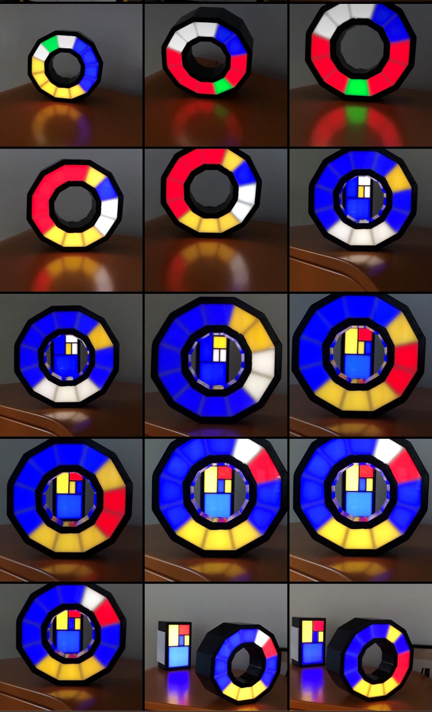
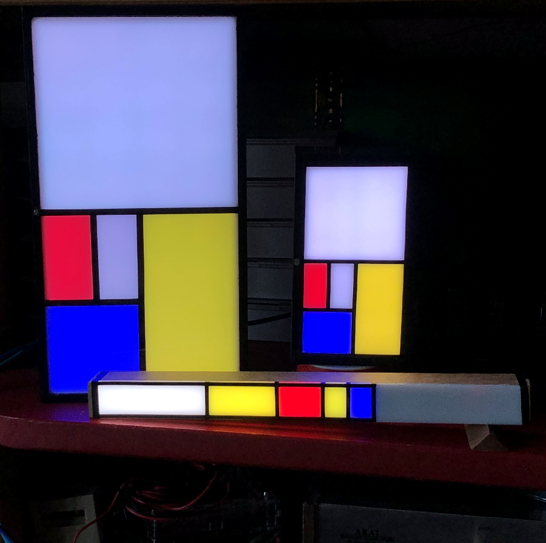

# Round 12 segment Fibonacci clock

This 12-segmentklok is a variation of the [Fibonacci clock](https://ednieuw.home.xs4all.nl/Woordklok/FibonacciClock/Fibonacciclock.html) 
The software is able to use a MAX7219 display to display the time digitally, 
It drives twelve SK6812 RGBW LEDs,  
operates a HM-10 or HC-05  Bluetooth module for communication , 
uses the ZS-042 DS3231 RTC time module a very accurate clock and  
a KY-040 rotary encoder for emergencies to operate the clock. 
With the menu several display otion can be chosen. 
More here: [12-Segment clock](https://ednieuw.home.xs4all.nl/Woordklok/Fibo12SegKlok/12SegFibonacci.html)

Deze ronde 12 segmentenklok is een variatie op de [Fibonacciklokkast](https://ednieuw.home.xs4all.nl/Woordklok/FibonacciClock/Fibonacciklok.html)   
De software is vereenvoudigd en geschikt voor de WS2812- en SK6812-kleuren-LED's.
Deze ronde klok kan ook de tijd chronologisch als een gewone klok weergeven. 
De kleuren zijn dan nog wel gelijk aan de Fibonacciklok. 

 Een uitgebreide handleiding is [hier te vinden]
(https://ednieuw.home.xs4all.nl/Woordklok/FibonacciStick/Fibonaccistick.html)  
en voor de bouw van de kast hier: [Twaalf-segmentklok]
(https://ednieuw.home.xs4all.nl/Woordklok/Fibo12SegKlok/12SegFibonacci.html)

Usage Arduino
=============
Om de software te compileren zijn nodig de libraries:
- Adafruit Neopixel
- RTClib bij Adafruit
- Encoder by Paul Stofregen 
- Keypad by Mark Stanley, A Brevig (ipv de encoder)

In deze klok wordt gebruik gebruikt van kleuren en oppervlakten die de reeks van Fibonacci volgen.
Deze reeks is 1,1,2,3,5. De oppervlakten van de segmenten is de klok.  
Wat de klok doet is de verlichting aanzetten achter de vlakken die opgeteld 
moeten gaan worden.  
Om de uren en minuten te combineren wordt een derde kleur, blauw, gebruikt.  

De rode vlakken zijn de uren.  
De gele vlakken vermenigvuldigd met 5 zijn de minuten en
de blauwe vlakken als er een rode en gele hetzelfde vlak bezetten.  
De witte vlakken betekenen nul, die stellen niets voor met optellen.

Fibonacci was een Italiaanse wiskundige die de naar hem genoemde 
getallenreeks ontwikkelde. Het was niet een normale getallenreeks maar een die 
ook vaak in natuurlijke processen voorkomt. Bijvoorbeeld in zonnebloemen en 
schelpen.  
De reeks is simpel. Elk volgend getal in de reeks is de som van de twee 
voorgaande: 1, 1, 2, 3, 5, 8, ....   
Als wij 1, 1, 2, 3, 5 optellen komen wij op 12.  
Ah, precies het aantal uren in een dagdeel en 12 vermenigvuldigt met 5 is het 
aantal minuten in een uur.

Voorbeeld: 4 uur.  
Dat kan een optelsom zijn van : 1+1+2 of 1+3.  
Voorbeeld: 8 uur.  
Dat kan bereikt worden met het optellen van 1+1+2+4, of 1+3+4 of 3+5.  
De display van de klok is een weergave van de Fibonacci-reeks en de oppervlakte 
van de vlakken is de verhouding van de oppervlakte in de reeks.  
Als het nu duizelt is het goed.

Nog een voorbeeld. 3:35.  
Dat zijn drie rode (uren) vlakken en 35/5 = 7 gele (minuten) vlakken.  
Drie kan je maken met het 1 vlak + 2 vlak of alleen met het 3 vlak.  
Zeven kan zijn 1 + 1 + 5 of 2 + 5 of 1 + 1 + 2 + 3.  
3:35 tot en met 3:39 geven dezelfde 7 minutenvlakken maar de kloksoftware 
probeert elke minuut een andere combinatie te vinden. Dit gaat random dus het 
kan zijn dat hij weer dezelfde combinatie vindt en niet verspringt.

Hoe laat is het in de foto?  
- 1 x rood + 2 x blauw = 3 uur.  
- 3 x geel + 2 x blauw = 5 minuutsegmenten van 5 minuten = 25.  
-> Dus 3:25 maar het kan ook nog 3:29:59 zijn
